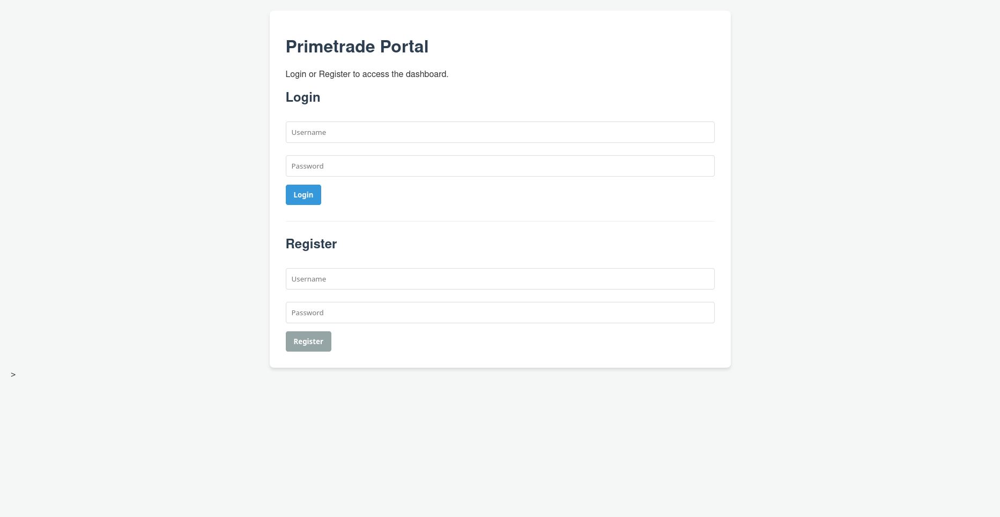

# Primetrade - Backend Developer Intern Task


A robust, scalable REST API built with Python and Flask, featuring JWT authentication, Role-Based Access Control (RBAC), and secure CRUD operations.

## Core Features Implemented

- **Authentication:** Secure user registration and login using `Werkzeug` password hashing and `Flask-JWT-Extended`.
- **Role-Based Access Control (RBAC):** Differentiates between standard `user` and `admin` roles for data access and modification.
- **Modular Architecture:** Utilizes Flask Blueprints and the Application Factory pattern for high maintainability.
- **Database Management:** Built with SQLAlchemy 2.0 (`Mapped` typing) for clean ORM schema management (currently using SQLite, ready for PostgreSQL).
- **Logging:** Automated file-based logging (`app.log`) for server monitoring and debugging.
- **Basic Frontend:** Includes a zero-build-step Vanilla JS UI (`index.html`) to instantly demonstrate API functionality.

---

## Architecture & Scalability Strategy

While this prototype utilizes a monolithic Flask structure with a local SQLite database for rapid deployment, it is specifically designed for seamless horizontal scaling in a Web3/Trading environment:

1. **Stateless Authentication:** By utilizing JWTs, the API remains completely stateless. This allows us to deploy multiple instances of the backend behind a Load Balancer (e.g., Nginx, AWS ALB) without worrying about sticky sessions.
2. **Microservices Readiness:** The Application Factory pattern and API Blueprints allow the `Auth` and `Tasks` modules to be easily decoupled into distinct microservices as the platform grows.
3. **High-Throughput Data Layer:** The SQLAlchemy ORM makes migrating to a production-grade **PostgreSQL** cluster a one-line config change. To handle high-frequency read queries, a **Redis** caching layer can be introduced at the route level to minimize database latency.
4. **Asynchronous Processing:** For computationally heavy Web3 analytics, long-running tasks can be offloaded to background workers using **Celery + RabbitMQ**, keeping the main API thread unblocked and highly responsive.

---

## Quick Start Guide

### 1. Setup the Environment

Clone the repository and navigate into the project directory. It is recommended to use a virtual environment:

```bash
python3 -m venv venv
source venv/bin/activate  # On Windows use: venv\Scripts\activate
```

1. Install Dependencies

```bash

pip install -r requirements.txt
```

1. Environment Variables

Create a `.env` file in the root directory and add your secret keys:
Code snippet

```bash
SECRET_KEY=your-super-secret-dev-key
JWT_SECRET_KEY=your-super-secret-jwt-key
WERKZEUG_COLOR=0
```

1. Run the Server

Start the Flask application. The database (app.db) and log file (app.log) will be generated automatically on the first run.

```bash
python app.py
```

The server will start on (<http://127.0.0.1:5000>)

## Testing the APIs

There are two ways to interact with this backend:

1. The Postman Collection: Import the included Primetrade_API.json file into Postman to view and test all endpoints with pre-configured request bodies.

2. The Frontend UI: Simply open index.html in your web browser to access a fully functional dashboard that registers users, handles JWT tokens, and performs CRUD operations natively.
